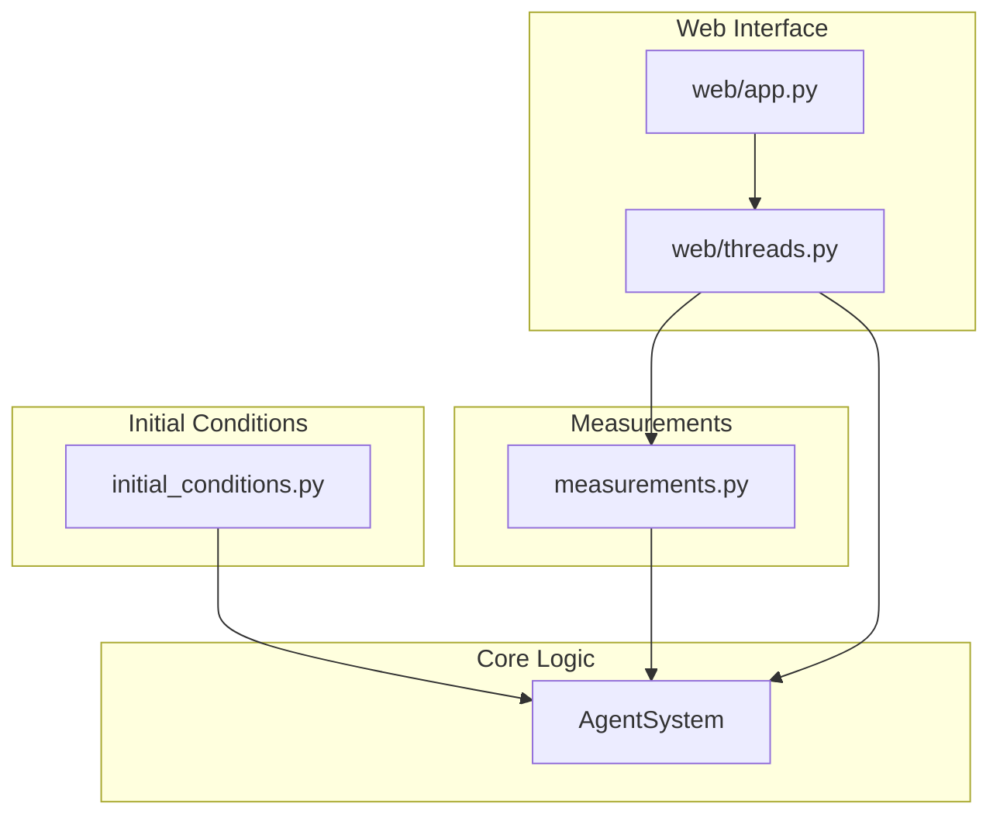

# Running the RPS GPU WebUI

## Cluster Setup Instructions

1. **Request a GPU node:**
   ```sh
   sinteractive
   ```

2. **Load required modules:**
   ```sh
   module load uv
   module load cuda12.6
   ```

3. **Run the application:**
   ```sh
   uv run src/app.py
   ```

4. **Access the web interface:**
   - The server will print a URL in the terminal. Open it in your browser.

## Architecture

The application's architecture is designed with a clear separation of concerns to enhance modularity and maintainability.



- **AgentSystem**: Contains the core simulation logic for the Rock-Paper-Scissors agent-based model.
- **initial_conditions.py**: Houses standalone functions responsible for setting up the initial states and configurations of the agent system.
- **measurements.py**: Provides functions for calculating various metrics and measurements from the simulation data.
- **web/threads.py**: Manages the background threads for the simulation and rendering, interacting with the `AgentSystem` and utilizing the measurement functions.
- **web/app.py**: The main entry point for the web interface, handling routes and overall application flow.
